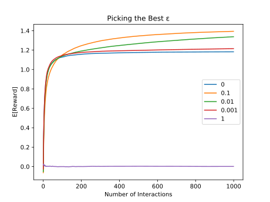

## Overview
Exploration of [Multi-armed Bandit](https://en.wikipedia.org/wiki/Multi-armed_bandit)
problem with stationary rewards distribution using ε-greedy agents.

**Assumptions**
 - environment with k actions
 - float positive or negative reward after the action is taken
 - reward sampled from a stationary rewards distribution (time independent)
 - agent is ε-greedy (picks random action with ε probability)

**Objective**
  - to maximize the expected total reward. Since the rewards distributions for each action
    is stationary, figure out the action that gives the largest expected total reward as fast
    as possible and take it every time.
  - pick the best ε

## Prerequisites
- **[Python 3](https://www.python.org/downloads/)**
- **[SciPy](https://www.scipy.org)**. The particular SciPy packages needed are:
    - **[numpy](http://www.numpy.org)**

## Running
Run the script to generate the graph of the best epsilon to pic for your agent.
The Expected reward for an action was averaged over 2000 bandit problems.

Data was generated using Gaussian distribution composed of 1000 points.
Each Gaussian corresponds to a reward distribution for an action. Across N
Gaussians Lower mean bound is -2, upper mean bound = 2 with std = 1.

main.py generates and saves the data for each ε and plots the expected reward
for an action as a function of interactions with environment

       python main.py

## Analysis
When ε = 1 we have a purely random agent. When ε = 0 we have a purely greedy
agent that does not take random actions. It appears that ε = 0.1 has a better
convergence to the max expected reward than other values and gives the best
reward than other ε-agents starting at ~120 interactions with the environment.
